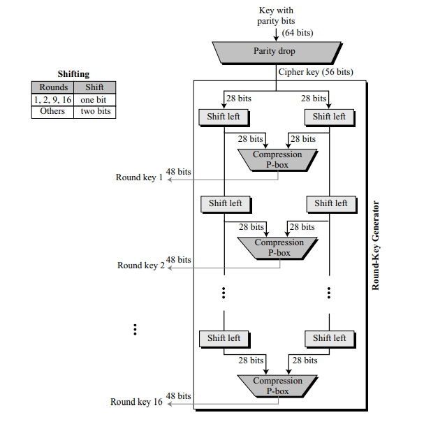
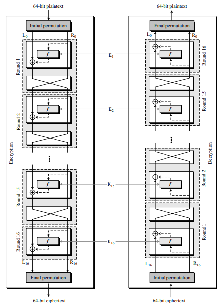

# DES 알고리즘 설명

DES 암호의 기본 구조는 Feistael Cipher* 방식으로, 페이스텔 네트워크, 페이스텔 구조,  
혹은 페이스텔 암호라 불리고 있다. 페이스텔 네트워크에서는 라운드라는 암호화 단계를  
여러 번 수행하도록 되어있다.  
  
*Feistael Cipher 방식 : 데이터를 좌/우로 나누어 교대로 비선형 변환을 하는 구조로 키가 노출되어도 원래의 함수를 알아내지 못해 보안성이 좋다는 장점이 있다.  
  
두 개의 치환(P-box)과 16개의 페이스텔 라운드 함수로 구성된다.
- 두 개의 P-box 중 하나는 초기 치환(Initial Permutation), 다른 하나는 최종 치환(Final Permutation)이라고 한다. 가장 처음과 마지막에 사용한다.
- 각 라운드는 키 생성기*에 의해 암호 키로부터 생성된 48비트 라운드 키를 사용한다.

*키 생성기(key schedule) : 각 라운드에 사용될 서브키(라운드 키)를 생성하는 알고리즘  
parity-bits 64비트에서 8비트를 제외한 56비트를 키 K로 사용한다. 56비트를 28비트로 분할한 후에 Compression P-box를 사용하여 각 라운드 마다 다른 48비트 서브키를 생성한다.  

## 암호화 과정

    [DES 암호 시작]  
    (1) 64비트 평문을 DES가 받고, 초기 치환(Initial Permutation) 진행

        [라운드 과정(16회)]
        (2) (1)의 평문이 32비트 블록 단위로 나뉨(L과 R)
        (3) 키 스케줄로 생성된 48비트 키 K*와 32비트 R이 f-function에 진입

            [f-function 과정]
            (4) 32비트 R을 Expantion-permutation을 진행하여 48비트로 확장
            (5) 확장된 48비트와 서브키 Ki를 XOR 연산 => 48비트 생성
            (6) (5)의 XOR로 얻은 48비트는 6비트씩 8부분으로 나뉘어 S-box에 진입
                -> 총 8개의 S-box에 6비트씩 적용되어 4비트를 출력한다.
            (7) 4비트씩 8부분으로 32비트가 생성
            (8) 32비트는 Straight-permutation을 거쳐서 나열됨

        (9) f-function을 거친 32비트(R)와 L을 XOR 연산을 함
        (10) 마지막 라운드를 제외하고 swap 실행하여 L과 R을 교체

    (11) 총 16라운드를 거친 후 최종 치환(Final Permutation)을 하고 64비트 암호문 생성  

